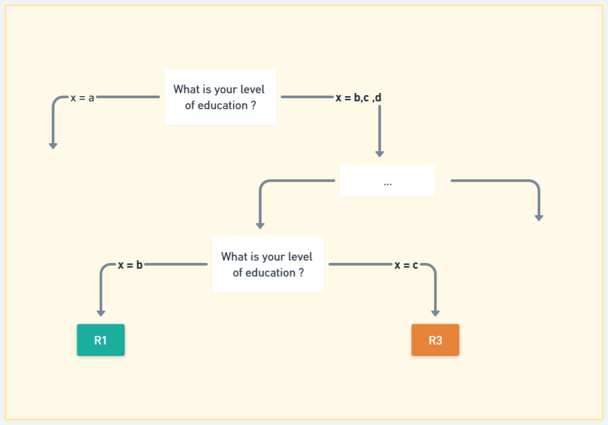
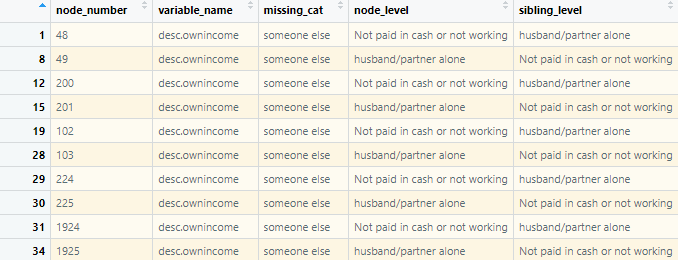
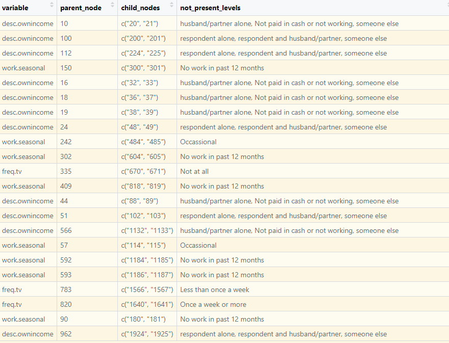
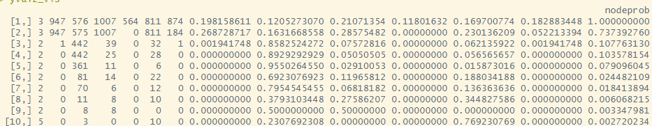

# Dealing with Logical dead ends in CART Output

## What is a Typing Tool?

The Pathways Typing Tool is a set of questions asked in a particular order to help teams ‘type’ or place an individual into a Pathways segment using a statistical model.

Provided the questions are asked in the correct order, Pathways typing tools have an accuracy rate of 80% or higher in placing someone in the correct segment

A logical dead end occurs when:

- A categorical level that was present in an upstream node is not represented in the split at a subsequent decision point
- A categorical level that is known to exist for a variable in the training dataset is not used in either split

Why do logical dead ends occur?

- It happens as we are deploying [CART](https://en.wikipedia.org/wiki/Decision_tree_learning) models trained on survey data to real-world scenarios

- The CART models learn decision rules based on the specific patterns that existed in the training data (e.g., DHS). But certain combinations of scenarios - usually rare but can still exist in real life - may not exist in the survey data. For these scenarios, the CART tree never learned what to do with it, since it only learned how to split based on the data combinations present during training (DHS).

Need to address two points:

1. How to automatically detect logical dead ends ?
2. How to deal with logical dead ends ?

## I. Methods to detect logical dead ends

### A. Top Down first search approach

**Objectives**: Follow each path from root to leaf node, and if a variable is used twice to make a split, verify that no level of the categorical variable disappears at the second occurrence.

This can be implemented using the detect_lost_label function (see below for R code).

- The function loops through every path obtained from path.rpart, stores the variable and level for each splitting node.
- When a variable is detected a second time, the levels with the first occurrence are compared.
- If one of the levels from the split has disappeared, then the node is flagged in the function.

The output of detect_lost_label is a data frame storing the variable name, first seen levels, level remaining at the possible dead-end, disappeared dead-end, and the number of the leaf node that the path goes through the possible dead-end.

Once a splitting node is identified with a missing level, we need to check that the level is not present in the sibling node. This can be implemented in R using the identify_dead_ends function (see code below). The inputs of the function are the dataframe from the detect_lost_label function and the frame object from the rpart output.

- For each level that disappeared, the function verifies that the level isn’t present in any of the levels from the possible dead-end‘s sibling.
- If the level is absent, then we have a real dead-end.

The output from the function is a data frame where each row is a dead-end. The columns are the node number, affected variable, missing level, level present at the node, and level present at the sibling node.

Additional functions to find a sibling node, get all node numbers, variables, and levels for a given leaf node are also provided (see below)

Output for rural segmentation, Northern Nigeria 2016

### B. Csplits method (TBC)

rpart.object$csplits

From rpart documentation:

*There is a row for each such split, and the number of columns is the largest number of levels in the factors. Which row is given by the index column of the splits matrix. The columns record 1 if that level of the factor goes to the left, 3 if it goes to the right, and 2 if that level is not present at this node of the tree (or not defined for the factor).*

**Objectives**: Identify all primary splits in the tree where one of the available levels for a category isn’t present in this split of the tree

**Note**: Using the csplits method alone is not sufficient: a level could be absent simply because it has been excluded from the path by a previous split of the same variable (eg. x=a would be absent at the second split on page 1)

**Challenge**: Csplits relies on the split index, while detect_lost_label output is based on the node number

Node Number

- The "node number" uniquely identifies each node in the tree.
- It follows a binary tree indexing scheme:
  - Root node: 1
  - Left child of node n: 2 * n
  - Right child of node n: 2 * n + 1
- This indexing allows you to understand parent-child relationships.
Split index: The row number in csplit is stored in the "index" column of splits for categorical split

rpart$splits:

- One row per split.
- Tied to the non-leaf nodes only (i.e., nodes where frame$var != "\<leaf\>").
- Order matches the order of internal nodes in frame.

Final output for rural segmentation, Northern Nigeria DHS7-2016,  after linking csplit and frame for main nodes only:

Note that some nodes still need to be excluded here before automating the detection of dead ends using only the csplit method

## II. Technical solutions to deal with logical dead-ends

Once logical dead ends have been identified for a given problem, various solutions can be employed to prevent the issue from becoming a problem in the typing tool.

From the previous steps, the following information is available about the node:

- Node number in rpart tree
- Variable used for the split
- Level used in the split as well as level of the sibling node
- Level in the variable that disappeared in the path
- Leaf node number

Note: The rpart output contains frame, a data frame with one row for each main and leaf nodes in the tree. The columns of frame include yval and yval2 which contains information about the output at that node.

- yval is the fitted value of the response at the node (segment predicted)
- yval2  is a matrix containing the fitted class, the class counts for each node, the class probabilities and the ‘node probability’ (classification trees).

So yval2 is an nxm matrix with:

n = number of nodes, m = 2k + 2, where k is the number of detected clusters

- Column 1 is essentially the yval object
- Column 2 to k +1 is the count per segment at the node
- Column k +2 to m-1 is the probability for each segment at the node
- Column m is the node probability

Solution to implement:

1. From the steps to detect a dead-end, the leaf node number is stored.
2. Obtain the sibling node number of the leaf, which may or may not be a leaf node.
  
  a. If the sibling is a leaf node, then store the segment assigned
  b. Else, follow all paths leaving from the sibling and collect the segment assigned at the end of each path.

Ultimately, a list of all segments that could be assigned to the dead-end node based on the current tree is stored

Then:

1. Use row.names to extract the row in frame$yval2 corresponding to the splitting node where the dead-end occurs
2. Extract the count per segment and probability for each segment in the list
3. Assign dead-end node to the segment with the highest probability and display probability and count in segment at the node.
4. Store the probability and count of the second-best choice, which can be communicated to the implementation/ field team.

You can find the R Code to detect logical dead-ends from rpart classification tree here:

- [Dead end detection](Dead_end_detection_c_split.R)
- [Some required functions](extra_rpart_functions.R)
